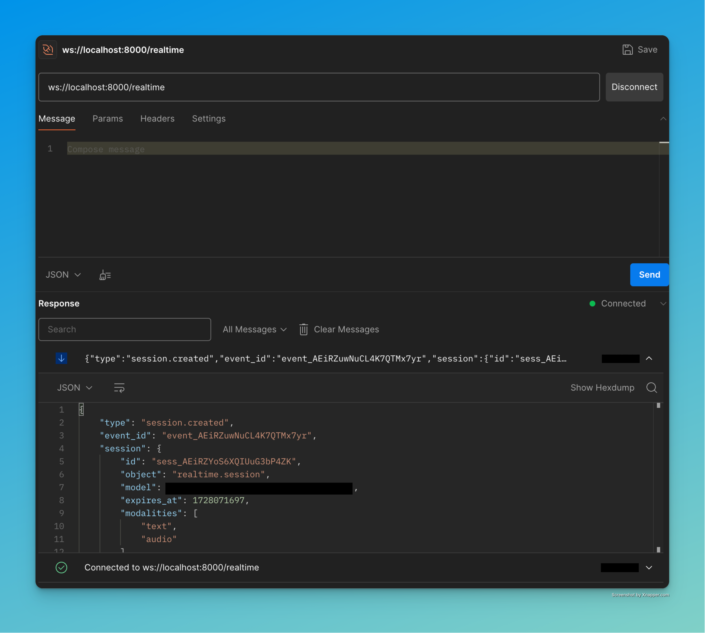

# openai-realtime-fastapi

This project facilitates real-time communication between FastAPI WebSocket connections and OpenAI's WebSocket connections, including compatibility with Azure OpenAI. It acts as a relay server that can be extended for security and customization purposes.




## Table of Contents

- [Overview](#overview)
- [Setup and Installation](#setup-and-installation)
- [Configuration](#configuration)
- [Usage](#usage)
- [Development](#development)
- [Benefits and Use Cases](#benefits-and-use-cases)
- [Acknowledgments](#acknowledgments)

## Overview

This application uses FastAPI to provide a WebSocket interface that connects with OpenAI's WebSocket API. The project is structured to handle real-time data exchange, making it suitable for scenarios where latency and live updates are crucial. It also supports integration with Azure OpenAI.

## Setup and Installation

### Prerequisites

- Python 3.8+
- An OpenAI API Key or Azure OpenAI API Key

### Installation

1. Clone the repository:

   ```bash
   git clone https://github.com/Geo-Joy/openai-realtime-fastapi
   cd openai-realtime-fastapi
   ```

2. Set up a virtual environment:

   ```bash
   python -m venv venv
   source venv/bin/activate  # On Windows use `venv\Scripts\activate`
   ```

3. Install dependencies:

   ```bash
   pip install -r requirements.txt
   ```

4. Create a `.env` file in the root directory with the following content. Use the appropriate URL depending on whether you are using OpenAI or Azure OpenAI:

   ```env
   OPENAI_API_KEY="your-openai-api-key"
   OPENAI_REALTIME_URL="wss://api.openai.com/v1/realtime?model=gpt-4o-realtime-preview-2024-10-01"
   USE_AZURE_OPENAI=False
   ```

   For Azure OpenAI, replace the URL as follows and set `USE_AZURE_OPENAI` to `True`:

   ```env
   OPENAI_API_KEY="your-azure-openai-api-key"
   OPENAI_REALTIME_URL="wss://<sub-domain>.openai.azure.com/openai/realtime?api-version=2024-10-01-preview&deployment=gpt-4o-realtime-preview"
   USE_AZURE_OPENAI=True
   ```

## Configuration

Configuration settings are managed using environment variables loaded from a `.env` file. The main configuration file is `config.py`, which retrieves values like `API_KEY` and `VENDOR_WS_URL` from the environment.

## Usage

To start the application, use Uvicorn to run the FastAPI server:

```bash
uvicorn main:app --reload
```

The application should now be running on `http://localhost:8000`.

## Development

### Key Files

- `main.py`: Initializes the FastAPI app and includes routers for various endpoints.
- `health_check.py`: Provides a simple health check route.
- `realtime.py`: Manages the WebSocket connection and data relay logic.

## Benefits and Use Cases

The openai-realtime-fastapi project can act as a relay server with various advantages:

1. **Security and Privacy**:

   - **API Credential Protection**: By routing requests through a server, API keys are kept secure and hidden from client-side exposure.
   - **Sensitive Data Handling**: Execute sensitive operations server-side to prevent leakage or manipulation from client-side interactions.

2. **Controlled Environment**:

   - **Centralized Logic**: Define and manage business logic server-side, ensuring uniform application behavior and more straightforward updates.
   - **Restricted Access**: Permit only specific types of requests and responses between the client and third-party services, enhancing security and rule enforcement.

3. **Authentication and Authorization**:

   - **Flexible Authentication Mechanisms**: Implement various authentication strategies (e.g., OAuth, JWT, API Key) based on application requirements to ensure secure client-server interactions.
   - **Single Sign-On (SSO)**: Enable SSO to streamline user access, reducing the need for multiple login credentials, while keeping vendor connections and API interactions hidden from the end-user.

4. **Reduced Client Complexity**:

   - Clients can interface with a simplified API rather than directly interact with complex third-party services.
   - Streamline client-side applications since logic and API integrations are managed server-side.

5. **Flexibility for Tests and DevOps**:
   - Mock or alter API responses for different environments without impacting production clients.
   - Seamlessly switch between different service providers or deployments.

## Acknowledgments

- [FastAPI](https://fastapi.tiangolo.com/)
- [OpenAI API](https://openai.com/api/)
- [Azure OpenAI](https://azure.microsoft.com/services/cognitive-services/openai-service/)
- Contributor: Geo Joy (https://www.linkedin.com/in/-itsg/)
